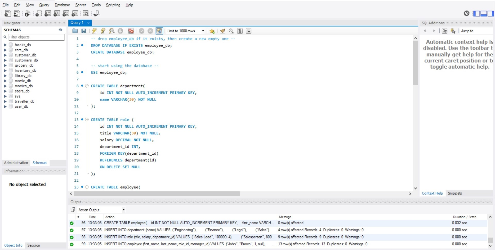
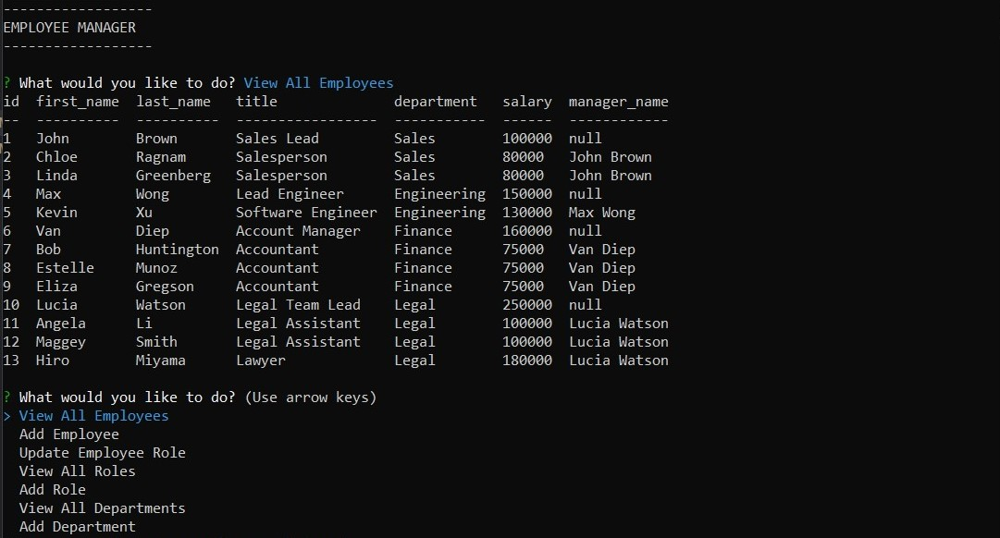

# Employee Tracker

## Description

This is an application using mysql2, inquirer, and console.table to keep track of employees in a database. The database is created, stored, and seeded using MySQL.

The application is used to keep track of all departments, roles, and employees in a company. This allows for a comprehensive, laid out format to view all tables and do actions to edit and add into these tables. There are various methods in the program to view well-formatted tables, or to add new inputs. There's also an option to update an employee's role. This helps view everything in a single application, rather than needing to individually run ``SELECT`` statements using MySQL.

## Structure

The ``employee_db`` database is created using MySQL. The schema is created and seeded using the MySQL workbench.

There are three tables in the database are: ``department``, ``role``, and ``employee``. They are all connected using unique IDs from each table; the ``role`` table references ``department`` using a department_id. For example, the "Legal Assistant" and "Lawyer" roles are all in the Legal Department. Likewise, ``employee`` references ``role`` using a role_id for each employee in the database. There are multiple Legal Assistants so their role IDs are all the same number to reflect that. 

Additionally, some employees have a manager which is reflected using the manager_id column; the number in the manager_id column represents the ID of the manager. For example, Chloe and Linda report to John, so their manager_id in the ``employee`` table is ``1`` which refers to John. On the other hand, John has no direct manager, so his manager_id is ``null``.

## Process

Upon navigating to the program folder and installing the necessary npm packages, the user can start up the program using ``npm start``.

From there, a list of options will appear and can be chosen using the arrow and Enter keys.

- **View All Employees**: Displays all of the employees with the following information: id, first name, last name, title (role), department, salary, manager name. The title, department, and salary all refer to other tables to display this information.
- **Add Employee**: Allows the user to add a new employee by providing the employee's name, role, and manager. If a manager isn't chosen, the manager_id in the table will be ``null``.
- **Update Employee Role**: Update an employee's role to something else.
- **View All Roles**: Displays all of the roles with the following information: id, title, department, salary. Department is taken from the department table based off of the department_id.
- **Add Role**: Adds a new role to the table. Will be placed under one of the existing departments from the user's choice.
- **View All Departments**: Displays all of the departments with the department id and name.
- **Add Departments**: Add a new department to the table.

## Links

Link to walkthrough video: [https://drive.google.com/file/d/1f7-WXg0AraJJ5-luQDqXLr9AAsE6fQd3/view](https://drive.google.com/file/d/1f7-WXg0AraJJ5-luQDqXLr9AAsE6fQd3/view)

Link to GitHub repository: [https://github.com/cindyung56/employee-tracker](https://github.com/cindyung56/employee-tracker)